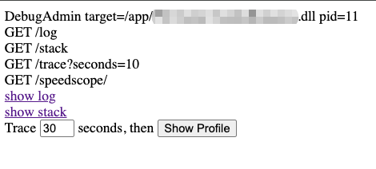
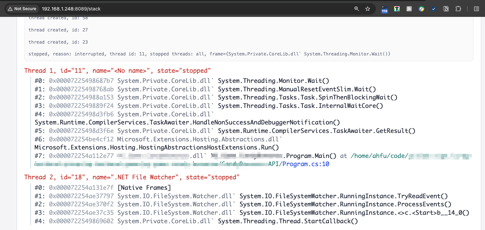
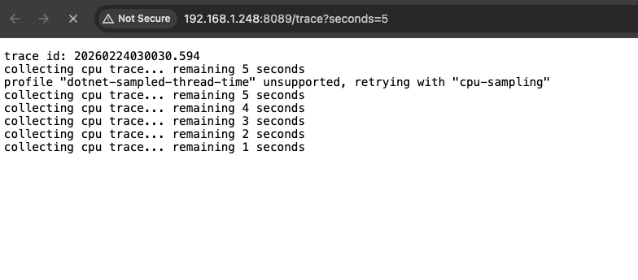
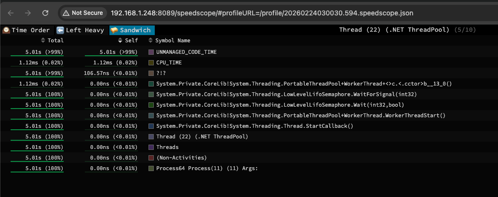

<h1>CSharp Debug Container</h1>
A all-in-one docker image for online debug your C# backend server.

https://hub.docker.com/repository/docker/ahfuzhang/csharp-dbg-all-in-one/general

<h1><font color=red>Never use it in your production environment.</font></h1>

# How to use

* Build your C# backend

```bash
dotnet build xxx.csproj -c Debug \
  -p:DebugType=portable \
  -p:DebugSymbols=true \
  -p:EmbedUntrackedSources=true \
  -p:EmbedAllSources=true \
  -p:ContinuousIntegrationBuild=true \
  -p:Optimize=false
```

* Run in docker

```bash
docker run -it --rm --name=csharp_debug_admin_test \
	--platform linux/amd64 \
	--network="host" \
	--cpuset-cpus="2" \
	-m 512m \
	-v "/home/ahfu/code/MyProj/bin/Debug/net6.0/":/app/ \
	-w /app/ \
	-e ASPNETCORE_ENVIRONMENT=Local \
	-e ASPNETCORE_URLS=http://localhost:5190 \
	ahfuzhang/csharp-dbg-all-in-one:dotnet6 \
		/usr/bin/DebugAdmin -admin.port=8089 -startup="/app/MyProj.dll -param1=1"

```

* Use browser

visit: `http://${your-server}:8089/`

1. main page



2. Show Stack information:



3. Use `dotnet-trace` to collect cpu profile



4. After trace, we will see the CPU profiling info.



# [WIP]

制作一个 All-in-one 的镜像，便于在线调试 DotNet 程序。

支持如下功能：
* 预先安装 DotNetSDk 6.0/8.0/10.0
* 安装 dotnet-trace
* 安装 CodeServer (web 版本的 vs code)
  - 安装 vs code Extension
* 安装 netcoredbg 调试器
* 安装 vsdbg 调试器
* 内置 speedscope 项目的火焰图浏览工具

同时开发一个 golang http server 来做管理接口:
* 启动进程功能
  - 直接启动 ✅
  - 调试器启动
* trace 采样功能
  - 指定采样 n 秒 ✅
  - 使用内置的 speedscope 展示火焰图   ✅
* 查看堆栈功能
  - 使用 netcoredbg 挂载进程，并且展示堆栈 ✅
* web 调试器功能：
  - 创建 netcoredbg 进程，然后通过 stdin / stdout 来通讯，可以通过浏览器进行更友好更好用的单步调试
* 日志 push 功能
  - 可以选择把 stdout 的日志，直接推送到 VictoriaLogs
* metrics push 功能
  - 可以选择把 metrics 数据 push 到 VictoriaMetrics
* 压测功能
  - 内置 wrk / nghttp，可以直接开启压测
* CodeServer 功能
  - 如果指定源码目录，可以通过 code server 浏览和编辑源码  
