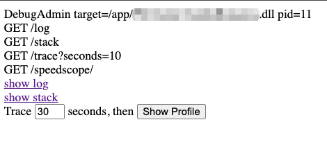
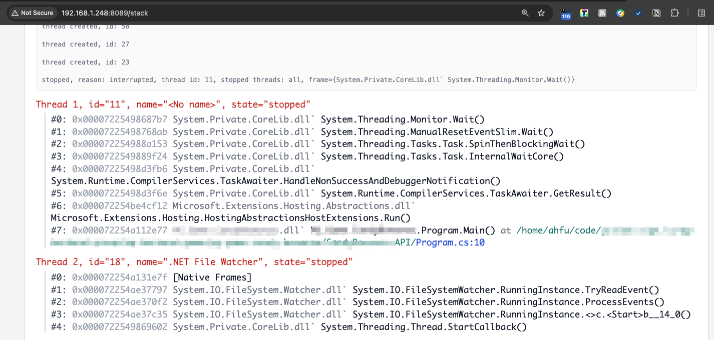
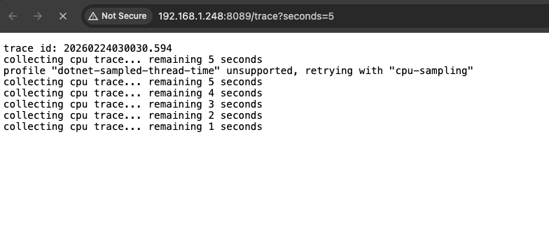
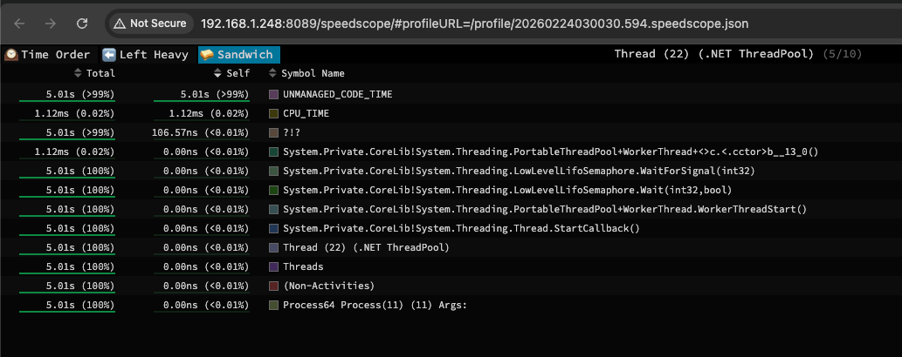

<h1>CSharp Debug Container</h1>
A all-in-one docker image for online debug your C# backend server.

https://hub.docker.com/repository/docker/ahfuzhang/csharp-dbg-all-in-one/general

<h1><font color=red>Never use it in your production environment.</font></h1>

# How to use

* Build your C# backend

```bash
dotnet build xxx.csproj -c Debug \
  -p:DebugType=portable \
  -p:DebugSymbols=true \
  -p:EmbedUntrackedSources=true \
  -p:EmbedAllSources=true \
  -p:ContinuousIntegrationBuild=true \
  -p:Optimize=false
```

* Run in docker

```bash
docker run -it --rm --name=csharp_debug_admin_test \
	--platform linux/amd64 \
	--network="host" \
	--cpuset-cpus="2" \
	-m 512m \
	-v "/home/ahfu/code/MyProj/bin/Debug/net6.0/":/app/ \
	-w /app/ \
	-e ASPNETCORE_ENVIRONMENT=Local \
	-e ASPNETCORE_URLS=http://localhost:5190 \
	ahfuzhang/csharp-dbg-all-in-one:dotnet6 \
		/usr/bin/DebugAdmin -admin.port=8089 -- /app/MyProj.dll -param1=1

```

* Use browser

visit: `http://${your-server}:8089/`

1. main page



2. Show Stack information:



3. Use `dotnet-trace` to collect cpu profile



4. After trace, we will see the CPU profiling info.



## Command line params

* /usr/bin/DebugAdmin
  - 由这个管理程序来启动被调试的服务器程序
* options:
  - `-admin.port=8070`: 提供 web 管理端的端口，可以使用浏览器访问，查看/开启某些功能
  - `-log.push.url=http://victoria_logs_addr`: 使用 vector 来接收服务器进程的 stdout 的日志，并且让 vector 以 jsonline 的方式把日志发送到 victoria logs 服务器。
    - eg: `http://vlogs-singlenode-k8s.logging.svc.cluster.local:9428/insert/jsonline?_time_field=_time,Timestamp&_msg_field=Message,message&_stream_fields=Level,level,pod,ip&ignore_fields=&decolorize_fields=&AccountID=0&ProjectID=0&debug=false&extra_fields=`
  - `-log.stdout.output`: 存在这个选项时，将把被调试进程的 stdout 再次作为 DebugAdmin 的 stdout 进行输出。
  - `-coredump.unlimited`: 存在这个选项时，修改 linux 中关于 `ulimit -c` 的配置，以便崩溃时可以生成 coredump 文件。
  - `-auto.restart`: 存在这个选项时，程序会在异常崩溃的时候，自动重新拉起。
  - `-with.gdb`: 存在这个选项时，以 gdb 命令脚本启动被调试程序。例如 `/app/MyProj.dll -param1=1` 将以 `gdb -x <script> --args dotnet /app/MyProj.dll -param1=1` 启动。脚本会在 `run` 前配置信号处理和日志；崩溃信息写入 `/tmp/YYYYMMDD-HHMMSS.log`，可从 Run History 中打开查看。
  - `--`: 分隔符。这个分隔符之后，就是 dotnet 服务器程序的命令行参数
    - 如果 `--` 之后的第一个路径以 xx.dll 结尾，则会自动加上 `dotnet xx.dll -params=value`

# [WIP]

制作一个 All-in-one 的镜像，便于在线调试 DotNet 程序。

支持如下功能：
* 预先安装 DotNetSDk 6.0/8.0/10.0
* 安装 dotnet-trace
* 安装 CodeServer (web 版本的 vs code)
  - 安装 vs code Extension
* 安装 netcoredbg 调试器
* 安装 vsdbg 调试器
* 内置 speedscope 项目的火焰图浏览工具

同时开发一个 golang http server 来做管理接口:
* 启动进程功能
  - 直接启动 ✅
  - 调试器启动
* trace 采样功能
  - 指定采样 n 秒 ✅
  - 使用内置的 speedscope 展示火焰图   ✅
* 查看堆栈功能
  - 使用 netcoredbg 挂载进程，并且展示堆栈 ✅
* web 调试器功能：
  - 创建 netcoredbg 进程，然后通过 stdin / stdout 来通讯，可以通过浏览器进行更友好更好用的单步调试
* 日志 push 功能
  - 可以选择把 stdout 的日志，直接推送到 VictoriaLogs ✅
* metrics push 功能
  - 可以选择把 metrics 数据 push 到 VictoriaMetrics
* 压测功能
  - 内置 wrk / nghttp，可以直接开启压测
* CodeServer 功能
  - 如果指定源码目录，可以通过 code server 浏览和编辑源码  
