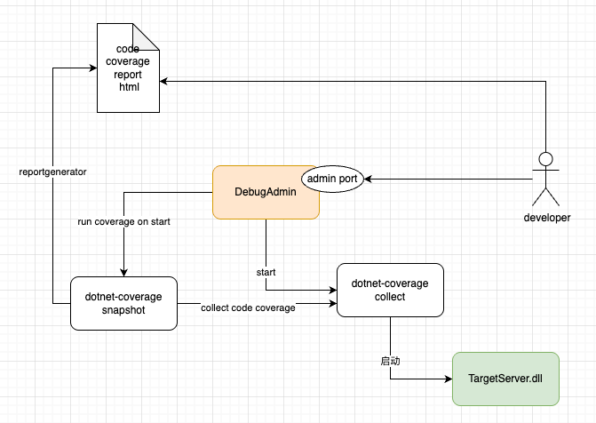
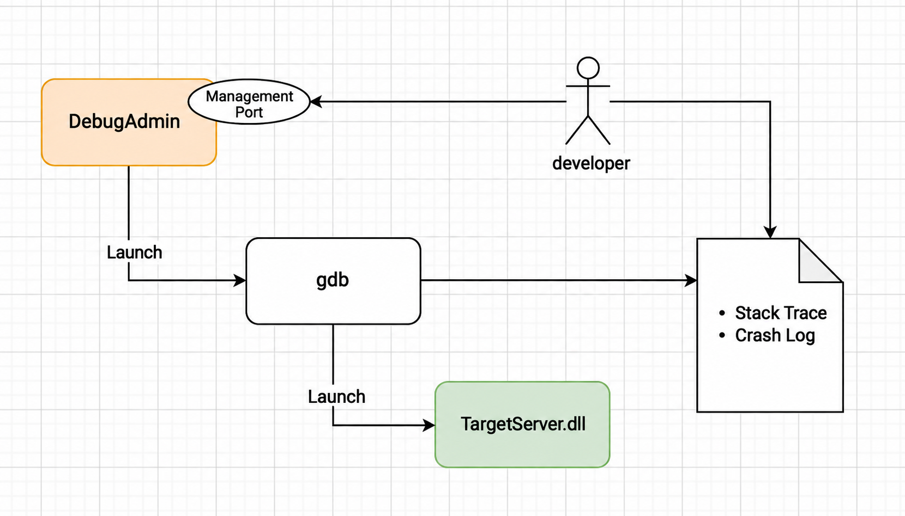
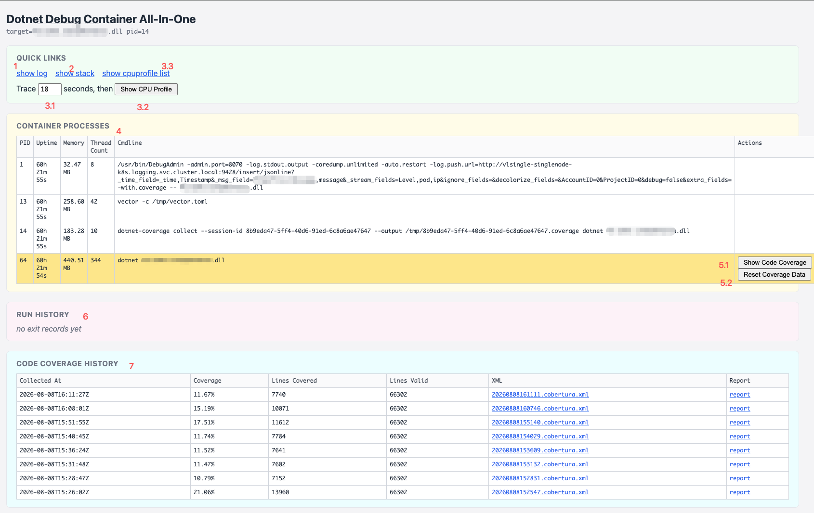
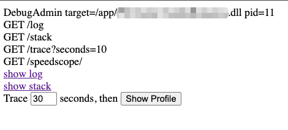
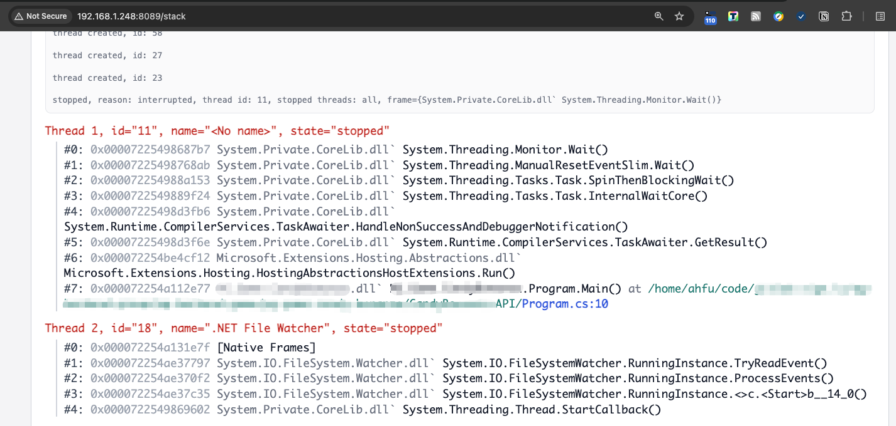
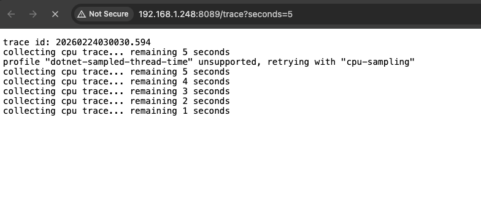
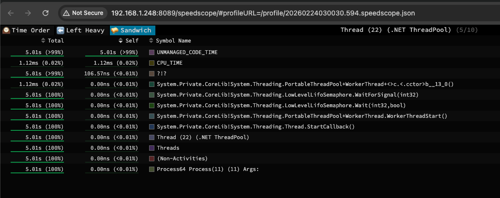

<h1>CSharp(DotNet) Debug Container</h1>
A all-in-one docker image for online debug your DotNet backend server.

[中文](./README_cn.md)

https://hub.docker.com/repository/docker/ahfuzhang/csharp-dbg-all-in-one/general

<h1><font color=red>Never use it in your production environment.</font></h1>

# docker

```bash
docker pull ahfuzhang/csharp-dbg-all-in-one:dotnet10
docker run -it --rm ahfuzhang/csharp-dbg-all-in-one:dotnet10 DebugAdmin -h
```

# Run mode

## Code coverage mode



## Gdb mode



# Debug Admin UI



* 1 show log: open a new tab to see latest log
* 2 show stack: show stack info
* 3 CPU Profiling
  - 3.1 Set collection time
  - 3.2 click button to start collect
  - 3.3 open a new tab to show history data
* 4 show all process in current container
* 5 to get code coverage data
  - 5.1 open a new tab to show code coverage report
  - 5.2 reset code coverage data
* 6 show restart log
* 7 show code coverage history  

# How to use

* Build your DotNet backend

```bash
dotnet build xxx.csproj -c Debug \
  -p:DebugType=portable \
  -p:DebugSymbols=true \
  -p:EmbedUntrackedSources=true \
  -p:EmbedAllSources=true \
  -p:ContinuousIntegrationBuild=true \
  -p:Optimize=false
```

* Run in docker

```bash
docker run -it --rm --name=csharp_debug_admin_test \
	--platform linux/amd64 \
	--network="host" \
	--cpuset-cpus="2" \
	-m 512m \
	-v "~/code/MyProj/bin/Debug/net6.0/":/app/ \
	-w /app/ \
	-e ASPNETCORE_ENVIRONMENT=Local \
	-e ASPNETCORE_URLS=http://localhost:5190 \
	ahfuzhang/csharp-dbg-all-in-one:dotnet6 \
		/usr/bin/DebugAdmin -admin.port=8089 -- /app/MyProj.dll -param1=1

```

* Use browser

visit: `http://${your-server}:8089/`

1. main page



2. Show Stack information:



3. Use `dotnet-trace` to collect cpu profile



4. After trace, we will see the CPU profiling info.



## Command line params

* /usr/bin/DebugAdmin
  - This admin program is used to launch the server program being debugged
* options:
  - `-admin.port=8070`: the port of the web admin UI, which can be accessed via a browser to view/enable certain features
  - `-log.push.url=http://victoria_logs_addr`: use vector to collect the stdout logs of the server process, and let vector send the logs to the victoria logs server in jsonline format.
    - eg: `http://vlogs-singlenode-k8s.logging.svc.cluster.local:9428/insert/jsonline?_time_field=_time,Timestamp&_msg_field=Message,message&_stream_fields=Level,level,pod,ip&ignore_fields=&decolorize_fields=&AccountID=0&ProjectID=0&debug=false&extra_fields=`
  - `-log.stdout.output`: when this option is present, the stdout of the debugged process will also be output as the stdout of DebugAdmin.
  - `-coredump.unlimited`: when this option is present, modify the `ulimit -c` configuration in linux, so that a coredump file can be generated on crash.
  - `-auto.restart`: when this option is present, the program will automatically restart after an abnormal crash.
  - `-bind.cpus=2-4`: when this option is present, after the target process starts, `taskset -acp 2-4 $PID` is executed to bind it to the 3 CPU cores numbered 2 to 4 (inclusive). A comma-separated list is also supported, e.g. `0,2,4-6`. When `-with.gdb` or `with.coverage` is used, the real target process spawned by gdb / dotnet-coverage will be located automatically for CPU binding, so gdb or dotnet-coverage itself will not be mistakenly bound.
  - `-with.gdb`: when this option is present, the debugged program is launched via a gdb command script. For example, `/app/MyProj.dll -param1=1` will be launched as `gdb -x <script> --args dotnet /app/MyProj.dll -param1=1`. The script configures signal handling and logging before `run`; crash information is written to `/tmp/YYYYMMDD-HHMMSS.log`, which can be opened and viewed from Run History.
  - `with.coverage`: launch in code coverage collection mode. `-with.gdb` and `with.coverage` are mutually exclusive.
  - `--`: separator. Everything after this separator is the command line parameters for the dotnet server program
    - if the first path after `--` ends with xx.dll, `dotnet xx.dll -params=value` will be prepended automatically
  - Code coverage related:
    - `-coverage.exclude.re="${regexp}"`: exclude certain package names in the *.cobertura.xml file
    - `-coverage.xml.settings="xml file"`: add the `--settings ${xml_file}` option to the startup parameters of `dotnet-coverage collect`.
      - for the xml format, please refer to: [example.code.coverage.settings.xml](./doc/example.code.coverage.settings.xml)
      - used to specify which dlls to include and exclude
    - `-coverage.source.dirs="/dir1/;/dir2/"`: specify multiple source code directories when generating the html report
    - `-coverage.source.from.pdb`: when this option is present, source code will be automatically extracted from the pdb file to generate the html report
  - `-generate.pdb.from.dll`: when this option is present, after the target process starts, its working directory (`/proc/<pid>/cwd`) will be read asynchronously, and all dlls under it will be recursively traversed. For any dll that does not yet have a corresponding pdb, `ilspycmd --generate-pdb --disable-updatecheck --referencepath <dll directory> <dll>` will be used to generate a pdb file for it (the pdb is placed in the same directory as the dll; skipped if it already exists). This process does not block the admin http port from listening. It only runs once at startup, and is not repeated on auto-restart. Note: the dll directory must have write permission.
    - if `-coverage.xml.settings` is also specified, the `Include`/`Exclude` regex rules under `ModulePaths` in that xml will be used first to filter which dlls need a pdb generated.

# Feature list

Supports the following features:
* Pre-installed DotNetSDK 10.0 (also supports DotNetSDK 8.0/6.0)
* dotnet toolset
  * dotnet-trace
  * dotnet-coverage
  * dotnet-reportgenerator
  * ilspycmd (decompiler tool)
* CodeServer installed (web version of vs code)
  - vs code extensions installed
* Debuggers
  * netcoredbg debugger installed
  * vsdbg debugger installed
  * gdb installed
* Built-in speedscope flame graph viewer (for CPU Profiling)
* Built-in oss command line tool ossutil
* Built-in log processing tool vector
* Developed tools
  * golang http server as the admin interface: DebugAdmin
    * process launch features
      - direct launch
      - launch via debugger
      - launch via dotnet-coverage
    * trace sampling features
      - sample for n seconds
      - show flame graph with built-in speedscope
    * stack viewing feature
      - attach to the process using netcoredbg and show the stack
    * web debugger feature: ❌ (not yet developed)
      - create a netcoredbg process and communicate via stdin / stdout, so a more friendly step debugging experience can be provided through the browser
    * log push feature
      - optionally push stdout logs directly to VictoriaLogs
    * metrics push feature ❌ (not yet developed)
      - optionally push metrics data to VictoriaMetrics
    * load testing feature ❌ (not yet developed)
      - built-in wrk / nghttp, can directly start load testing
    * code coverage collection
      - collect coverage and generate the coverage xml file
      - generate the coverage xml report
      - reset coverage data
      - filter by dll when collecting coverage
      - filter by class name when collecting coverage
      - extract source code from pdb file when generating the coverage report
      - filter features:
        - filter by dll prefix
        - filter by class name using regex
    * decompilation on startup: check dependent dlls and automatically decompile the corresponding pdb files  
  * pdb_to_source: parse source code out of a pdb file
    - `/usr/bin/pdb_util`: golang implementation
    - `/usr/bin/pdb_to_source`: csharp implementation
  * dll version: used to view the version number of a dotnet dll  
* CodeServer feature ❌ (not yet developed)
  - if a source code directory is specified, the source code can be browsed and edited through code server  

# Article links

* [How can a CSharp backend server view code coverage while sending requests](https://www.cnblogs.com/ahfuzhang/p/20474477) (Chinese)
* [Debug Container All-In-One: a powerful tool for debugging C# backend crashes](https://www.cnblogs.com/ahfuzhang/p/21926708) (Chinese)
* [【CSharp Online Code Coverage Report】How to precisely see which line is covered after a single request](https://www.cnblogs.com/ahfuzhang/p/22611060) (Chinese)
